<p align="center">
  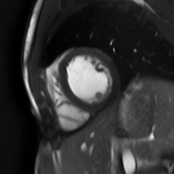  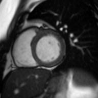
</p>

# Temporally consistent and controllable video generation of 2D cine cardiac MRI via latent space motion modeling

We introduce a novel text-to-video generative framework designed to synthesize high-fidelity, anatomically consistent, and temporally coherent 2D cine Cardiac Magnetic Resonance (CMR) sequences. To overcome the scarcity of diverse medical imaging datasets, our approach decouples spatial structure from temporal motion. First, a fine-tuned Stable Diffusion model generates a highly accurate initial frame conditioned on clinical text prompts (e.g., anatomy, diagnosis). Next, a dedicated latent flow diffusion model, guided by a pseudo-signal, simulates realistic cardiac motion. This framework provides a scalable, on-demand solution for medical data augmentation, helping to improve the robustness of downstream deep learning models in cardiovascular disease diagnosis.


This repository shares source code to run [training](#training-from-scratch), [inference](#inference), and a standalone gradio [demo](#demo) to generate motion from a text prompt.


<p align="center">
  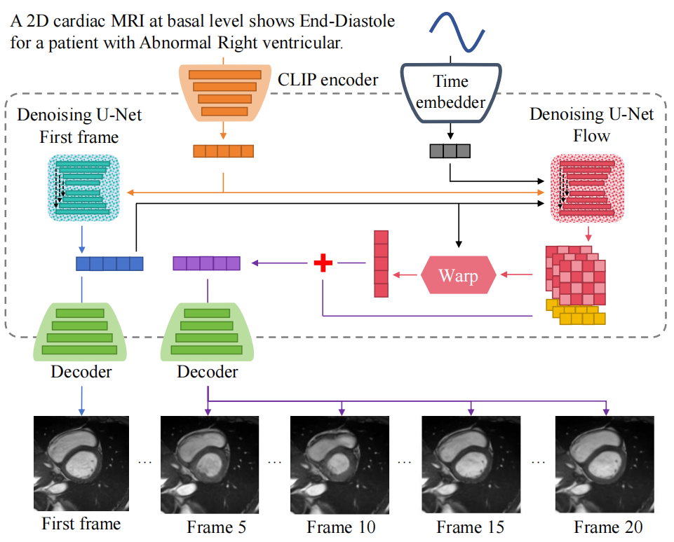
</p>

## Demo

1. Clone the repository:
```bash
git clone https://github.com/cyiheng/TextToCine2DMRI
cd TextToCine2DMRI
```

2. Create a virtual environment:
```bash
conda create -n text2cine python=3.10
conda activate text2cine
pip install torch==2.6.0 torchvision==0.21.0 torchaudio==2.6.0 --index-url https://download.pytorch.org/whl/cu118
pip install -r demo/demo_requirements.txt
```
3. Download the pre-trained weights for the demo and place them in the `results/` folder：
- Google Drive (not available yet, will update soon)
- [Baidu](https://pan.baidu.com/s/1NybeuS2JwO1jjmhhTqm6KA?pwd=jeua)

4. Run the gradio demo with the command:
```bash
python -m demo.app
```
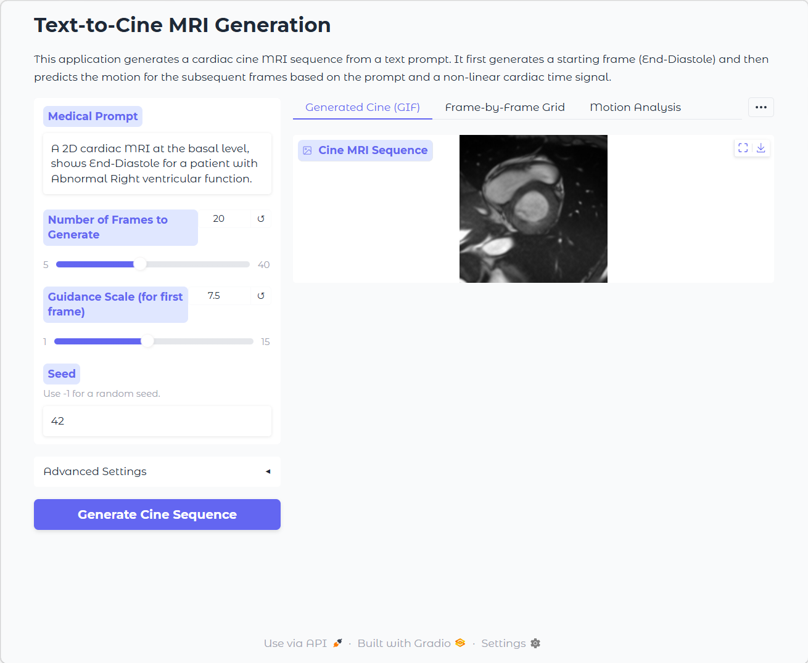


## Training from scratch

### Dependencies

1. Clone the repository:
```bash
git clone https://github.com/cyiheng/TextToCine2DMRI
cd TextToCine2DMRI
```

2. Create a virtual environment:
```bash
conda create -n text2cine python=3.10
conda activate text2cine
pip install torch==2.6.0 torchvision==0.21.0 torchaudio==2.6.0 --index-url https://download.pytorch.org/whl/cu118
pip install -r requirements.txt
```

### Data preparation
1. Download both [ACDC](https://www.creatis.insa-lyon.fr/Challenge/acdc/databases.html) and [Kaggle](https://www.kaggle.com/competitions/second-annual-data-science-bowl/overview) dataset in the folder `data/` and unzip them.
2. Use the preprocessing of [CineMA](https://github.com/mathpluscode/CineMA)
3. Make sure the preprocessed data is saved in folder `data/ACDC_preprocessed` and `data/DSB_nifti`. It will also generate the metadata.csv files for both datasets.
4. Preprocess both dataset to generate 2D slices:
```bash
# You might update the path in the code if you save the data in a different location
python preprocess/preprocess_to_2d.py
# You should obtain a dataset folder with the following structure:
# dataset/
# ├── ACDC_patient001_slice0/
#       ├── frame_000.png
#       ├── frame_001.png
#       ├── ...
# ├── ACDC_patient001_slice1/
# ├── ...
# ├── DSB_001_slice0/
# ├── DSB_001_slice1/
# ├── ...

```
5. Generate the anatomical label json file:
```bash
# Determines a granular anatomical level of a slice based on its relative 
# position in the heart stack, dividing it into six parts.
python preprocess/generate_anatomical_labels.py
``` 

6. (Optional) You can generate from scratch the metadata file for DSB, but metadata.csv files are already provided in the `data` folder. If you want to generate it from scratch, you can run:
```bash
python preprocess/parse_clinical_data.py    # -> generate DSB_only.csv
python preprocess/find_dsb_es_frame.py      # TODO: need to perform segmentation with CineMA first as it relies on the segmentation to find the ES frame (max volume)
python preprocess/merge_dsb_metada.py       # -> generate *_additional.csv with the clinical information
python preprocess/merge_es_data.py          # -> generate _additional_with_es.csv with the ES frame information
```

### Train
As the proposed method consists of 4 stages, we provide separate training scripts for each stage. You can run them sequentially to train the full model:
```bash
python -m train.train_stage1 # Finetune the VAE on the 2D data.
python -m train.train_stage2 # Train the flow predictor on the latent space.
python -m train.train_stage3 # Finetune the Stable Diffusion UNet on the first frame.
python -m train.train_stage4 # Finetune the Stable Diffusion UNet on the full sequence with flow guidance.
```

### Inference
The code for each step of inference is available to check quickly if it works per block.
```bash
python -m inference.inference_stage1.py 
...
python -m inference.inference_full.py 
```

The global inference `inference_full.py` allow to generate the full sequence from text prompt.


### Visual examples

| Random | visual | samples :) |
|---|---|---|
| 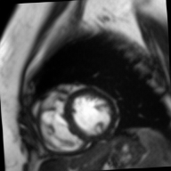 | 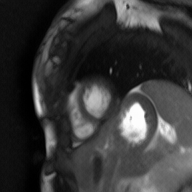 | 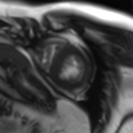 |
| 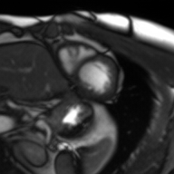 | 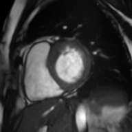 | 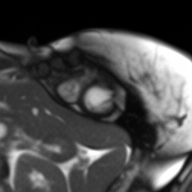 |
| 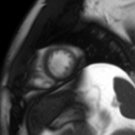 | 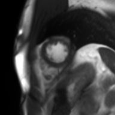 | 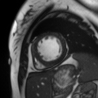 |

If you use this code for your research, please cite our papers.

```
TODO
```